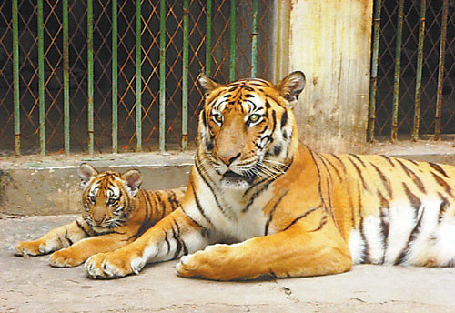
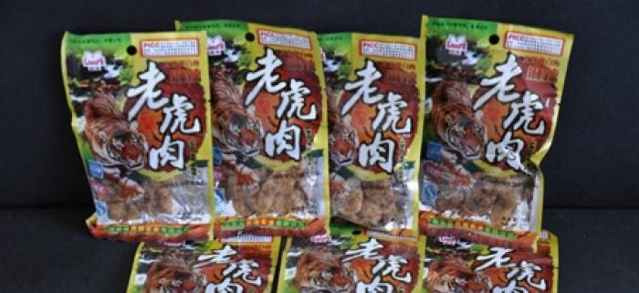

# ModelFeast
最全面的 pytorch 模型库（2D， 3D CNN）!
- [收录了时下最流行的 2D, 3D CNN 模型库](https://github.com/daili0015/ModelFeast/blob/master/tutorials/ModelZoo.md)
- [简化pytorch训练，保护发际线！](https://github.com/daili0015/ModelFeast/blob/master/tutorials/Scaffold.md)
- [一个可移植的pytorch项目模板](https://github.com/daili0015/ModelFeast/blob/master/tutorials/template.md)

## What is ModelFeast ?
假如说 model zoo 是这样的—
<center>

</center>
要想使用model zoo，还得做许多工作，数据预处理，创建dataloader，设置训练参数....
最坑最坑的是——
官方的model-zoo只能允许固定大小的输入！！
也就是说，如果我的图片是```32*32*1```的，必须变到```299*299*3```才能用inceptionV3训练！！！
丧尽天良啊！
太难受了吧！
相比之下，model-feast是这样的—
<center>

</center>
拆了包装就能吃！
不到3行代码，完成数据预处理、创建网络、训练、保存全部操作！
还支持resume，在原来的基础之上再训练！
任意图像尺寸都行！


## 已经实现的模型
### 2D CNN
- [Xception](https://github.com/daili0015/ModelFeast/blob/master/models/classifiers/xception.py)
- [InceptionV3](https://github.com/daili0015/ModelFeast/blob/master/models/classifiers/inception.py)
- [InceptionResnetV2](https://github.com/daili0015/ModelFeast/blob/master/models/classifiers/inceptionresnetv2.py)
- [SqueezeNet1_0, SqueezeNet1_1](https://github.com/daili0015/ModelFeast/blob/master/models/classifiers/squeezenet.py)
- [VGG11,  VGG13, VGG16, VGG19](https://github.com/daili0015/ModelFeast/blob/master/models/classifiers/vgg.py)
- [ResNet18, ResNet34, ResNet50, ResNet101, ResNet152](https://github.com/daili0015/ModelFeast/blob/master/models/classifiers/resnet.py)
- [ResNext101_32x4d, ResNext101_64x4d](https://github.com/daili0015/ModelFeast/blob/master/models/classifiers/resnext.py)
- [DenseNet121, DenseNet169, DenseNet201, DenseNet161](https://github.com/daili0015/ModelFeast/blob/master/models/classifiers/densenet.py)

### 3D CNN
- [resnet18v2_3d, resnet34v2_3d, resnet50v2_3d, resnet101v2_3d, resnet152v2_3d, resnet200v2_3d](https://github.com/daili0015/ModelFeast/blob/master/models/StereoCNN/resnetv2.py)
- [resnext50_3d, resnext101_3d, resnext152_3d](https://github.com/daili0015/ModelFeast/blob/master/models/StereoCNN/resnext.py)
- [densenet121_3d, densenet169_3d, densenet201_3d, densenet264_3d](https://github.com/daili0015/ModelFeast/blob/master/models/StereoCNN/densenet.py)
- [resnet10_3d, resnet18_3d, resnet34_3d, resnet101_3d, resnet152_3d, resnet200_3d](https://github.com/daili0015/ModelFeast/blob/master/models/StereoCNN/resnet.py)
- [wideresnet50_3d](https://github.com/daili0015/ModelFeast/blob/master/models/StereoCNN/wideresnet.py)
- [i3d50, i3d101, i3d152](https://github.com/daili0015/ModelFeast/blob/master/models/StereoCNN/i3d.py)

### CNN-RNN
还在做，但是框架已经写完了 [在这](https://github.com/daili0015/ModelFeast/blob/master/models/CRNN/CRNN_module.py).

## Features
- 只要3行代码，世界清静，什么数据导入、创建模型、训练保存，都有了 !
- 经典的2D CNN， 3D CNN全部都有 !
- 任意大小的图像尺寸输入都OK !
- 帮助你横扫各种项目与竞赛，这是我用modelfeast[参加的一个竞赛](https://github.com/daili0015/ModelFeast/blob/master/tutorials/ModelZoo.md#2-3d-convolutional-neural-network)，第三周周榜第9名！该比赛还在进行 
- 更多集成学习、模型融合方法，comming soon！我已经与平台的小姐姐商量好了，上面的比赛结束后（3月底），我会写一个教程，介绍我是怎么用modelfeast跑出第9名的成绩的；还会有医学图像处理、集成学习大礼包，直接给源代码，还有详细的注释与讲解！


## 参考资源
[https://github.com/lanpa/tensorboardX](https://github.com/lanpa/tensorboardX)
[https://github.com/pytorch/vision/tree/master/torchvision/models](https://github.com/pytorch/vision/tree/master/torchvision/models)
[https://github.com/kenshohara/3D-ResNets-PyTorch](https://github.com/kenshohara/3D-ResNets-PyTorch)
[https://github.com/victoresque/pytorch-template](https://github.com/victoresque/pytorch-template)
[https://github.com/AlexHex7/Non-local_pytorch](https://github.com/AlexHex7/Non-local_pytorch)
[https://github.com/Cadene/pretrained-models.pytorch](https://github.com/Cadene/pretrained-models.pytorch)