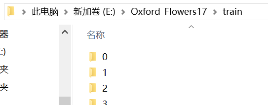

## If you want to train model
### 1. Prepare your dataset

For example, you can put image dataset in a folder.
I put it here: ```E:/Oxford_Flowers17/train```
<center>

</center>
Here are some datasets available:

| Baidu Yun | Google |
| :------: | :------: |
| [flowers17](https://pan.baidu.com/s/16PjFHGJf-IRxlIdxBz2LYQ)(kkdc) | [flowers17](https://drive.google.com/open?id=11h4O0V-qZ2OwEVd_MxeETN0AQLDvRtRL) |
| [SceneClass13](https://pan.baidu.com/s/1yLTLtVBgmHRPOZN65pnGrw)(0onp) | [SceneClass13](https://drive.google.com/open?id=1wxlpGjY9eKMrgn5FjXQVc5oN_6CP4TF9) |
| [AnimTransDistr](https://pan.baidu.com/s/1cDdfb8vJnZTPt-w3lMMulQ)(otd5) | [AnimTransDistr](https://pan.baidu.com/s/16PjFHGJf-IRxlIdxBz2LYQ) |

ps: Of course you can define dataloader on your own!
### 2. Train  within 3 lines
#### You can train from zero
```python
if __name__ == '__main__': # removing this line brings dataloader error, this is because of python's multithread feature
    clf = classifier('xception', 17, (200, 200), 'E:/Oxford_Flowers17/train')
    clf.train()
```
It will begin to train a Xception with dataloader with 17 classes, resize image to 200*200, load data from ```'E:/Oxford_Flowers17/train'```. Best model will be saved to folder ```"./saved"```every 2 epoch. To know more about default setting, click [here](https://github.com/daili0015/ModelFeast/blob/master/classifier.py#L59).
#### Or resume previous training
```python
if __name__ == '__main__':
    clf = classifier('xception', 17, (60, 60), 'E:/Oxford_Flowers17/train')
    clf.train_from('E:/ModelFeast/saved/xception/0305_130143/checkpoint_best.pth')
```
unbelievably simple, right ?!