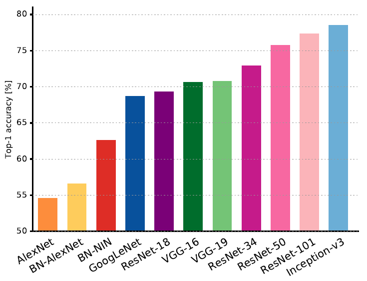
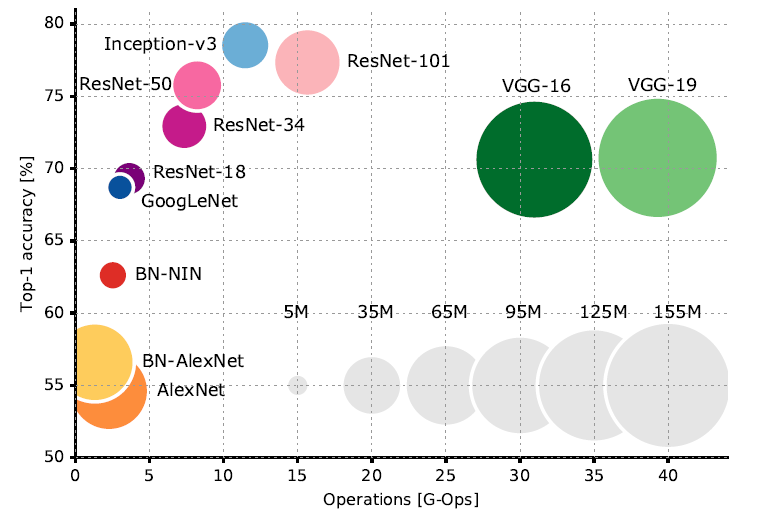

# 各种图像分类网络的比较
## 分类准确率与模型大小的比较
一篇对比各种网络的文章[在这里](https://arxiv.org/abs/1605.07678)，截取其中两张图：
首先是模型的准确率：

Fig 1. accuracy

然后是训练成本，模型大小，以及准确率的比较：

Fig 2. accuracy-complexity

可以看出，两个VGG模型的参数是最大的，训练成本也最高，但是准确率有限。所以，现在都到9012年了，首选肯定不会是VGG了。这是2017年的图，现在有了inceptionV4，DenseNet等等，最新的模型在准确率上拉不开太大的距离，选择一个模型小，训练快，方便移植，代码安装简单的就行了。我推荐直接用inceptionV3或者DenseNet。

更多网络的数据可以参考pytorch官方的不同网络[比较结果](https://github.com/Cadene/pretrained-models.pytorch#accuracy-on-validation-set-single-model)