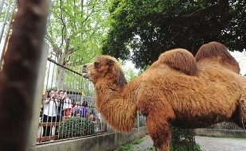
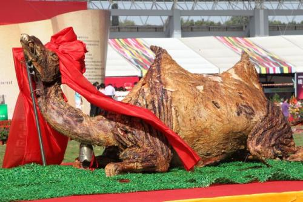

## What is ModelFeast ?
Let's make it as simple as possible.
This is model zoo—

You still need to do a lot of thing before you use(eat) the model(camel).

This is model feast—

All you need it's to open your mouth and chew(train).
It helps to save you time and workload a lot !
Life is short, I use ModelFeast.
